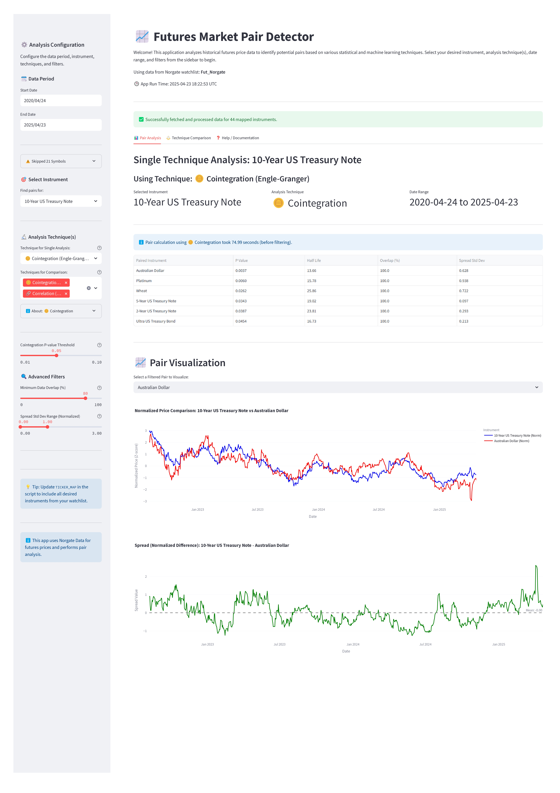
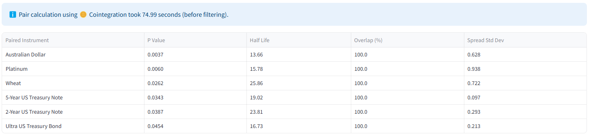
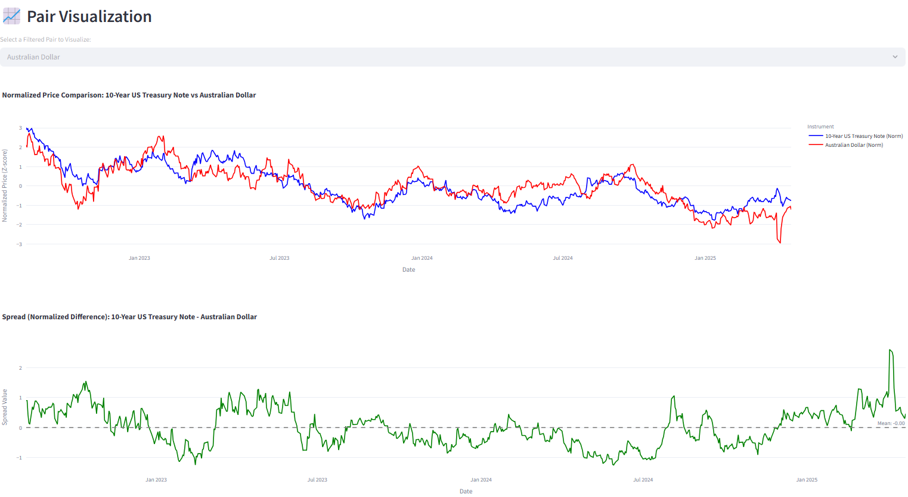
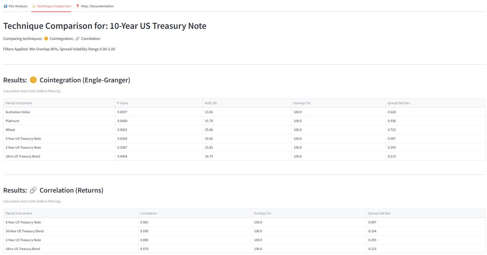

# 📈 Futures Market Pair Detector

## Overview

This project is a Streamlit web application designed to analyze historical futures price data and identify potential trading pairs based on various statistical and machine learning techniques. It leverages the Norgate Data service for high-quality historical futures data and provides interactive visualizations and filtering capabilities.

The goal is to help traders and analysts explore relationships between different futures contracts, potentially uncovering opportunities for pairs trading, hedging, or understanding market dynamics.

## Features

*   **Multiple Analysis Techniques:** Implements several distinct methods for pair discovery:
    *   🪙 **Cointegration (Engle-Granger):** Tests for long-run equilibrium between price series.
    *   🔗 **Correlation (Returns):** Measures linear relationships between daily returns.
    *   📏 **Distance (SSD):** Finds pairs with geometrically similar normalized price charts (Sum of Squared Differences).
    *   🧩 **Clustering (K-Means + SSD Rank):** Groups instruments with similar price patterns and ranks pairs within clusters.
    *   〰️ **Similarity (DTW):** Measures shape similarity allowing for time shifts (Dynamic Time Warping).
    *   ℹ️ **Mutual Information (Prices):** Detects both linear and non-linear dependence between price series.
*   **Norgate Data Integration:** Seamlessly fetches continuous futures contract data using the `norgatedata` library.
*   **Interactive UI:** Built with Streamlit for easy configuration and exploration.
    *   Selectable date ranges.
    *   Dropdown instrument selection.
    *   Choice of analysis techniques.
    *   Adjustable technique-specific parameters (e.g., p-value, correlation threshold, cluster count).
*   **Advanced Filtering:** Refine pair results based on:
    *   Minimum data overlap percentage.
    *   Spread Standard Deviation range (based on normalized prices).
*   **Visualization:** Plots normalized price series and the spread for selected pairs.
*   **Technique Comparison:** View and compare results from multiple techniques side-by-side.
*   **In-App Documentation:** Includes descriptions, pros/cons, use cases for each technique, and an FAQ section.
*   **Debugging Mode:** Optional mode to view detailed pre-filter calculation results.

## Screenshots

**Main Interface**


**Pair Results Table**


**Pair Visualization**


**Technique Comparison Tab**



## Setup and Installation

1.  **Prerequisites:**
    *   Python 3.8+
    *   Access to Norgate Data (including an installed `norgatedata` library and valid license/API key). See [Norgate Data](https://norgatedata.com/) for details.
    *   Git (optional, for cloning)

2.  **Clone the Repository (Optional):**
    ```bash
    git clone <your-repository-url>
    cd ClusteringPairs
    ```
    Alternatively, download the source code (`app.py`, `requirements.txt`).

3.  **Create a Virtual Environment (Recommended):**
    ```bash
    python -m venv venv
    # On Windows
    .\venv\Scripts\activate
    # On macOS/Linux
    source venv/bin/activate
    ```

4.  **Install Dependencies:**
    ```bash
    pip install -r requirements.txt
    ```
    *Note: `norgatedata` installation might require separate steps as per Norgate's instructions.*

5.  **Configure the Application:**
    *   Open `app.py` in a text editor.
    *   **`TICKER_MAP`:** This dictionary is crucial. You **MUST** populate it with the Norgate tickers (e.g., `&ES_CCB`) as keys and their desired display names (e.g., `E-mini S&P 500`) as values. Only instruments listed here will be processed.
    *   **`DEFAULT_WATCHLIST`:** Change this variable to the name of the Norgate watchlist you want to use.
    *   **`DEBUG_MODE`:** Set to `True` to see detailed filtering steps, `False` for normal operation.

## Usage

1.  **Ensure Norgate Data is configured** and accessible by the `norgatedata` library.
2.  **Activate your virtual environment** (if created).
3.  **Run the Streamlit application:**
    ```bash
    streamlit run app.py
    ```
4.  The application will open in your web browser.
5.  **Use the Sidebar** to:
    *   Select the desired **Date Range**.
    *   Choose the primary **Instrument** to analyze.
    *   Select one or more **Analysis Techniques**.
    *   Adjust **Technique Parameters** and **Advanced Filters**.
6.  **Explore the Tabs:**
    *   **"Pair Analysis":** View detailed results and visualizations for the single selected technique.
    *   **"Technique Comparison":** Compare filtered results across multiple selected techniques.
    *   **"Help / Documentation":** Understand the methodologies, view FAQs, and consult the technique selection flowchart.

## Dependencies

Key libraries used:

*   [Streamlit](https://streamlit.io/): Web application framework.
*   [Pandas](https://pandas.pydata.org/): Data manipulation and analysis.
*   [NumPy](https://numpy.org/): Numerical computing.
*   [Plotly](https://plotly.com/python/): Interactive charting.
*   [Statsmodels](https://www.statsmodels.org/): Statistical models (including cointegration tests).
*   [Scikit-learn](https://scikit-learn.org/): Machine learning tools (KMeans, StandardScaler, Mutual Information).
*   [dtaidistance](https://github.com/wannesm/dtaidistance): Dynamic Time Warping calculations.
*   [NorgateData](https://norgatedata.com/): Futures data provider library.
*   [streamlit-agraph](https://github.com/ChrisChross/streamlit-agraph): For rendering the flowchart graph.

*(Consider adding a LICENSE file, e.g., MIT License)*